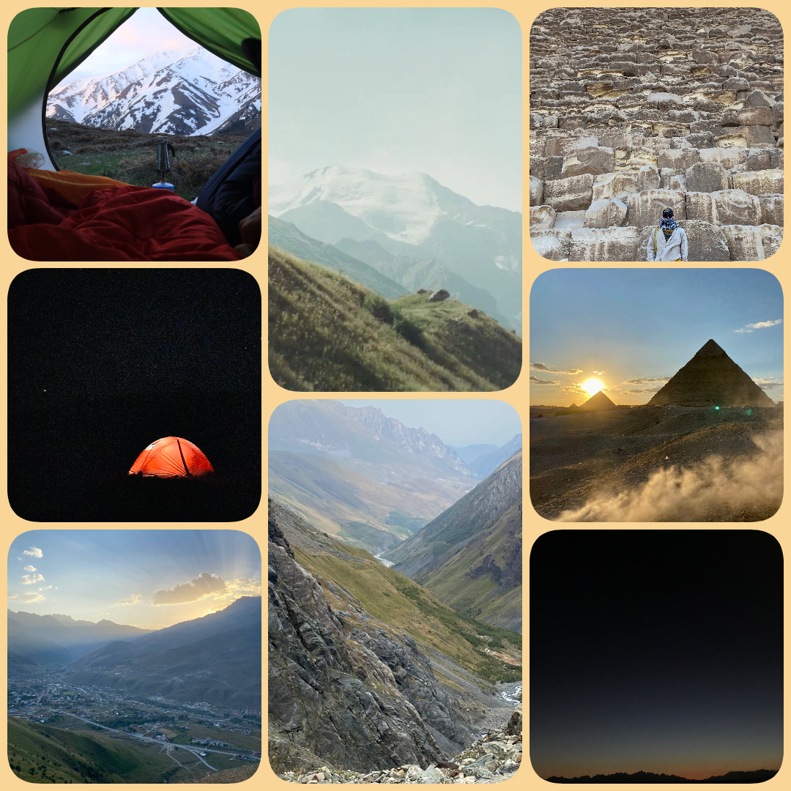

I love travelling to the mountains because it brings me peace and inspiration. Being in nature, surrounded by high peaks and fresh air, is an amazing feeling. I have visited the beautiful mountains of central Turkey, the wild nature of the Caucasian Reserve, and the impressive landscapes of North Ossetia. I have also travelled to Egypt, where deserts and mountains create unique views, and to China, with its beautiful and diverse scenery. Every trip to the mountains is special for me, giving me energy and unforgettable memories.

