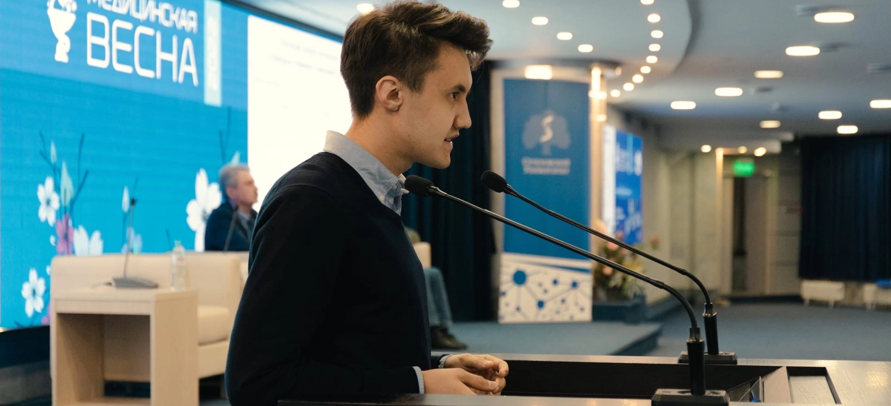

### Sechenov University

At my 2 and 3 years of my studies at Sechenov University, I have mentored medical students, who just started their career in science. This was my first mentroship under guidance of Center for Scientific Career at Sechenov University.

Last years I give the lecture for Master students in Sechenov University: Introduction to NGS technologies.

### Bioinformatics Institute 

At Bioinformatics Institute I work as a teaching assistant on Statistics and R course. I give seminars on data manipulation and visualization with *tidyverse* ecosystem and grade students projects.

