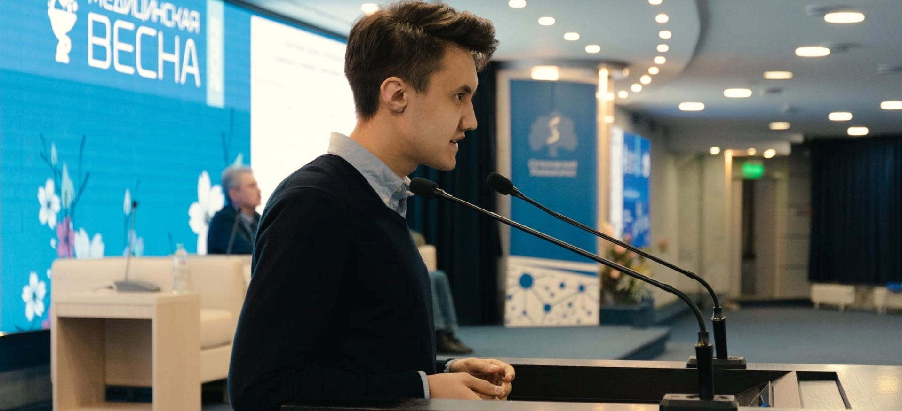

### Sechenov University

In my 2nd and 3rd years at Sechenov University, I mentored medical students who were just starting their scientific careers. This was my first mentorship experience, under the guidance of the Center for Scientific Career at Sechenov University.

In recent years, I have also given lectures for Master's students at Sechenov University on the course *Introduction to NGS Technologies*.

### Bioinformatics Institute

At the Bioinformatics Institute I work as a teaching assistant on the *Statistics and R* course. I lead seminars on data manipulation and visualization with the *tidyverse* ecosystem, and grade students' projects.

